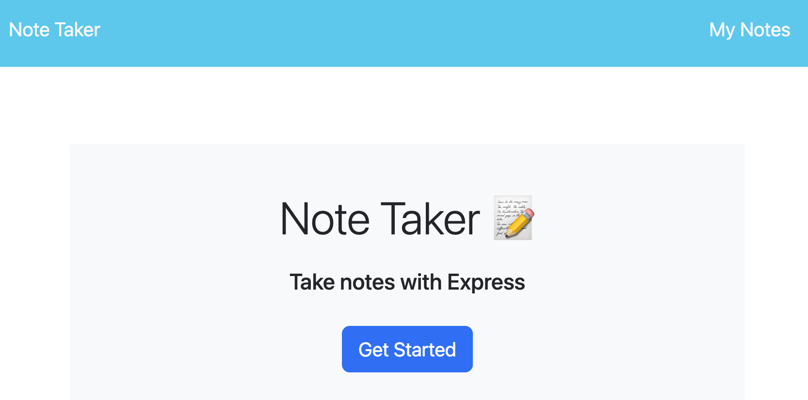
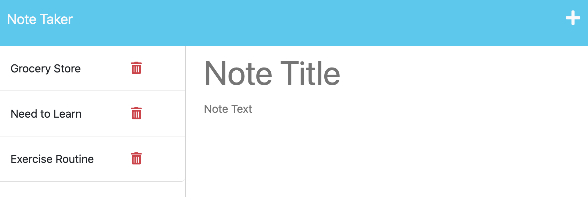
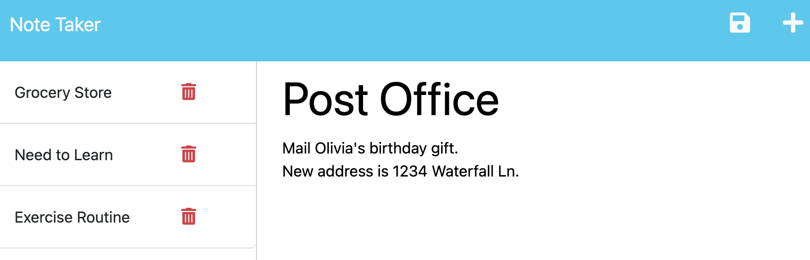
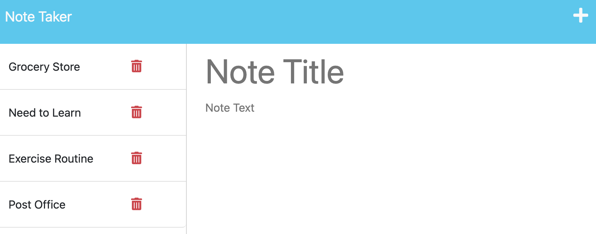
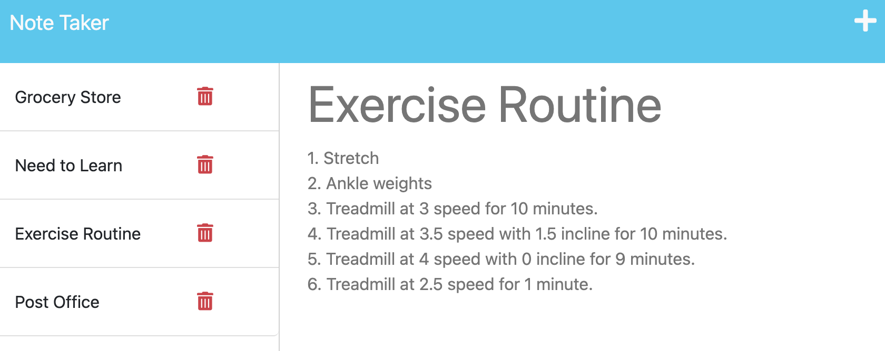
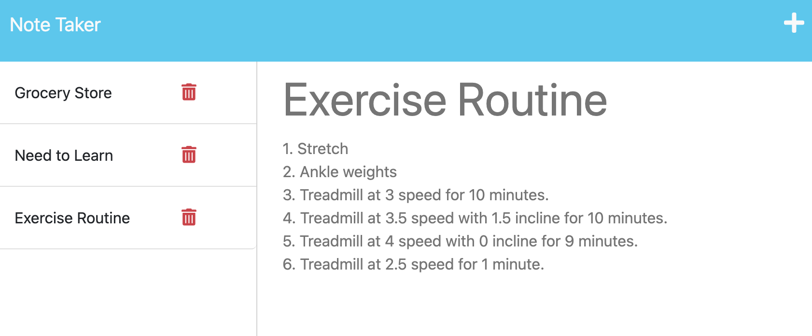

# Notes App

## Description

The Notes App is a quick and easy way to manage your notes.  You can write, save, recall, and delete your notes, as needed.

## Installation

N/A

## Usage

Click "Get Started"

Write your note title and text.

Click the save icon to save your new note.

Your new note is stored in the left pane.

Click on a saved note to view it.

Click the trash can item next to a note to delete it.

## Credits
- https://www.youtube.com/watch?v=SyiL0J80gDQ
- https://docs.google.com/document/d/1QtVfz6sniA_ZDQT_dataERgEXGfbLXADHkN0Xjdgl70/edit?usp=sharing
- https://www.w3schools.com/jsref/jsref_splice.asp
- https://github.com/sylviaprabudy/note-taker
- https://www.youtube.com/watch?v=wiFW3gQgfd8
- https://dev.to/gulshanaggarwal/npm-packages-to-generate-unique-ids-for-your-next-project-1p3b
- https://www.youtube.com/watch?v=SccSCuHhOw0
- https://www.npmjs.com/package/simple-random-number-generator
- Tutoring 06APR2023

## License

MIT License

## Deployed Application Link

<!-- Paste your deployed application link here. -->